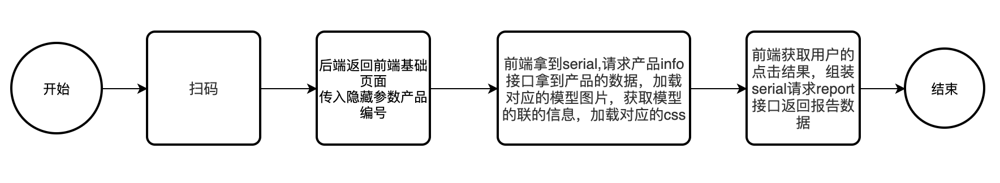
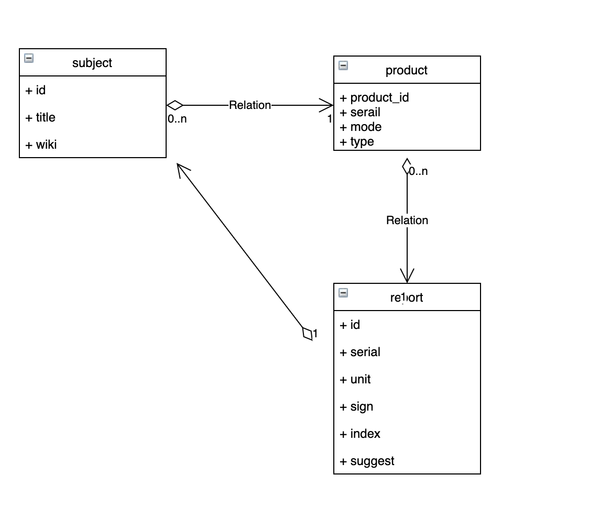

### 环境

服务器:centos8

语言:PHP 

服务架构：PHP+Nginx+Vue

后端框架：Laravel

数据库:mysql 


### 安装

1. 解包代码

2. 进入代码一级目录 执行

   ```php
   composer install
   ```

3. 配置.env  
   Index.php 已经拆分为index.php index-test.php 分别用于生产和测试环境 对应的加载.env.product  .evn.test。修改对应的db配置即可


### 设计文档

#### 流程图



#### 模型

product   产品
report     报告结果

subject   检测科目



### 设计思路

> 1. 每种产品对应一个二维码，二维码描述产品的编号，编号确定之后不能改变 每个产品对应了一个展示的模型，模型从左到右依次从1开始计数作为单元联的编号
> 2. 每一个联对应一种检测科目，每个科目出现的情况有4种分别是 不出现红线标识，T出现红线标识，C出现红线标识，TC都出现红线标识 分别用0，1，2，3表示，如果后续不只有TC，则需要对应的扩展
> 3. 扫码之后拿到产品serial 展示产品模型，返回给前端unit 和 模型类型
> 4. 前端收集用户的点击信息，后端计算通过每一联传递的信号生成对应的结果报告，组装就医建议，wiki等数据返回前端


### 使用说明

1 产品列表，配置产品信息，确定唯一的产品的编号，配置产品图片，产品类型对应的是模型的类型

2 配置每一联的检测科目和wiki数据

3 配置每一联的检查结果，分别用0-3标识


